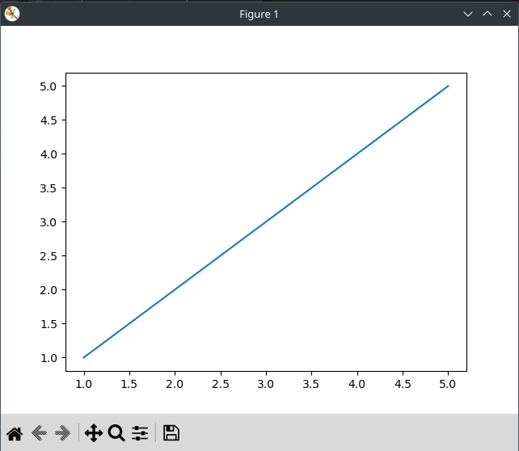

# Лабораторная работа №5
### Задание
1. Создайте в каталоге для данной ЛР в своём репозитории виртуальное окружение и установите в него matplotlib и numpy. Создайте файл requirements.txt.
2. Откройте книгу [1] и выполните уроки 1-3. Первый урок можно начинать со стр. 8.
3. Выберите одну из неразрывных функции своего варианта из лабораторной работы №2, постройте график этой функции и 
4. касательную к ней. Добавьте на график заголовок, подписи осей, легенду, сетку, а также аннотацию к точке касания.
5. Добавьте в корень своего репозитория файл .gitignore отсюда, перед тем как делать очередной коммит.
6. Оформите отчёт в README.md. Отчёт должен содержать:
    1. графики, построенные во время выполнения уроков из книги
    объяснения процесса решения и график по заданию 4
    2. Склонируйте этот репозиторий НЕ в ваш репозиторий, а рядом. Изучите использование этого инструмента и создайте pdf-версию своего отчёта из README.md. Добавьте её в репозиторий.

### Описание проделанной работы
Создал виртуальное окружение
Открыл книгу и выполнил уроки
Написал программу по варианту 8
добавил файл .gitignore
Оформил отчёт в файле readme.md

### Графики, построенные во время выполнения уроков из книги
#### 1 график

#### 2 график

#### 3 график

#### 4 график

#### 5 график

#### 6 график

#### 7 график

#### 8 график

#### 9 график

#### 10 график

#### 11 график

#### Инструкция по запуску
1. Открыть папку XRevLab5 с помощью VSCodium
2. Вызвать консоль и прописать `gcc work.py -o result` 
3. прописать в консоли `./result` 

### Вывод программы

### Ссылки
1. https://evil-teacher.on.fleek.co/prog_pm/term1/lab03/
